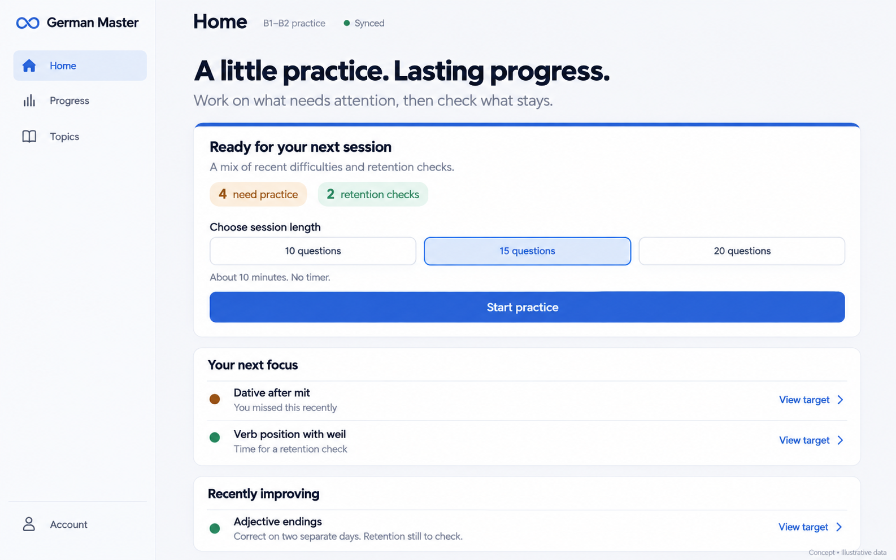
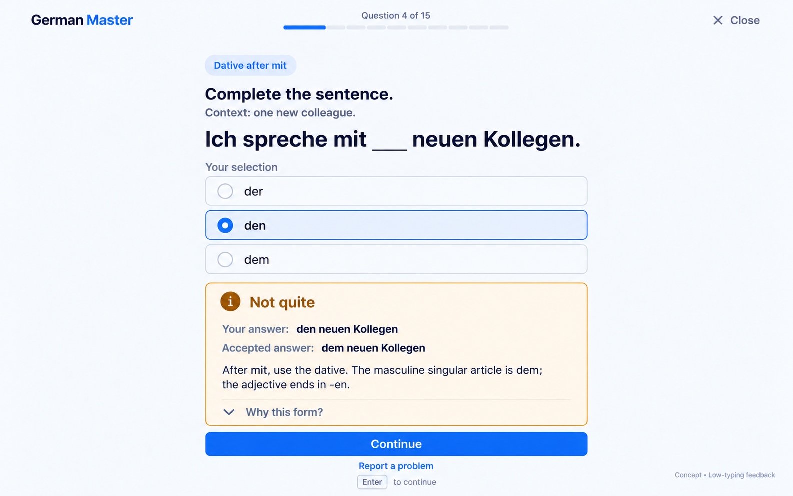
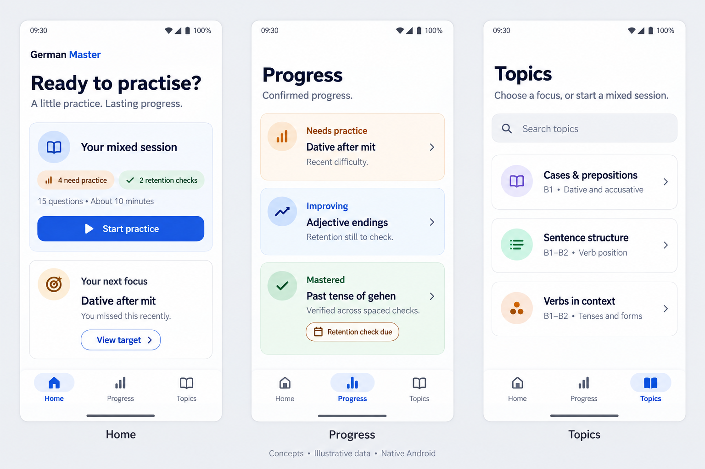
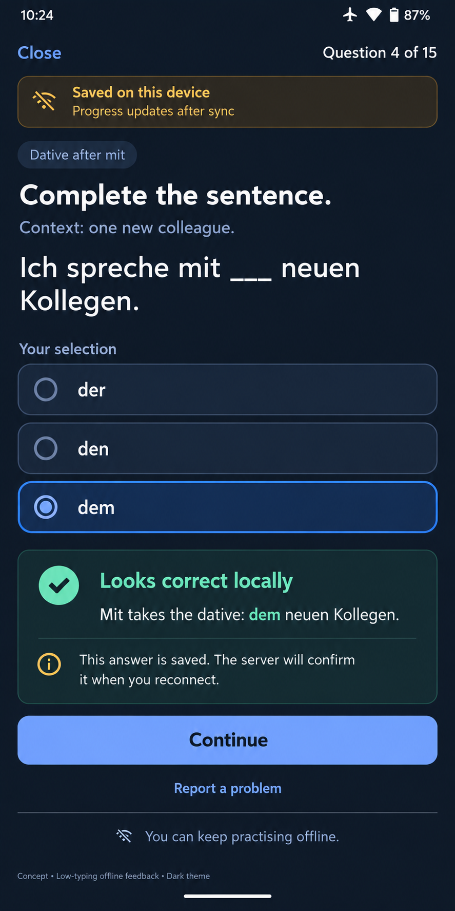

# German Master 2.0 visual concepts

Created 3 October 2026 at the owner's request, based on [the product blueprint](../../product/blueprint.md), especially Sections 5–11. The web and Android S04 practice boards were updated on 9 October 2026 to replace typed answer fields with low-typing choices. Four image boards depict six screens across web and native Android. These are proposed visual concepts with illustrative data, not screenshots of implemented 2.0 features or an approved final design. The Home, Progress and Topics boards retain the original October 3 direction; see [the subsequent study workspace redesign](../study-workspace.md).

## Desktop Home — S02

The compact rail has Home, Progress and Topics. One primary Start practice action leads to a mixed session. Needs-practice and retention-check counts stay separate. Session length is a question-count preference; the time estimate is not a countdown. Recently improving does not claim mastery after a single session.

## Desktop Practice feedback — S04

Practice removes the navigation rail. The sentence uses a single-slot gap choice: the learner selects an authored option rather than typing. This checked state retains the selected `den` radio choice, names the outcome, explains the accepted `dem` form and waits for Continue. Check is explicit before feedback; no second Check action is shown after grading. The singular context cue is necessary: without it, `den neuen Kollegen` could be correct plural German. This illustration is not a published/reviewed exercise revision.

## Native Android Home, Progress and Topics — S02, S06, S08

The bottom navigation has exactly three destinations; Practice opens separately. Progress groups are Needs practice, Improving and Mastered. A mastered target can still carry a Retention check due badge. Topics offer optional focus, not a locked syllabus. Native controls follow the same product behavior as web without requiring pixel-identical layouts.

## Native Android offline feedback, dark theme — S04

The native choice buttons retain the selected `dem` after an explicit Check, with no typed answer field or keyboard. The singular context matches the web example. Saved on this device and Looks correct locally distinguish durable local work from confirmed progress. The learner can continue without a blocking sync dialog. The [low-typing controls and offline paths](../../content/practice-formats.md) are implemented; this image remains an illustrative design concept rather than runtime or accessibility evidence.

## Design direction and review notes

- Calm study workspace with system sans typography, generous answer space, pale canvas, restrained blue actions and subtle card borders. Dark mode follows the blueprint's semantic palette.
- Outcomes have text and icons alongside color. No flags, trophies, streak pressure, mastery probabilities, countdowns or AI-chat surface.
- The proposed layout follows the blueprint's 48px/dp control baseline and readable practice column. Raster concepts do not establish actual contrast, target sizes, keyboard behavior, text scaling, responsive reflow or TalkBack/screen-reader accessibility; those remain implementation acceptance checks.
- Large offline status treatment and decorative icon accents are exploratory. During implementation keep sync status quiet, use consistent semantic tokens, and validate density on real device/window sizes.
- This set covers selected core states, not all S01–S12 screens. Next design coverage should include onboarding, unanswered and selected-before-Check low-typing states, word ordering and matching, session summary, target detail and narrow-web reflow. Typed controls remain for unconverted content; they are not the default direction for new practice.

Generated with the built-in image-generation tool: four generation calls and one targeted edit. No CLI/API fallback or Groq calls. All final assets were copied into this repository and visually inspected for layout, navigation, copy, feedback and offline-state consistency. The unselected initial feedback draft is not included. The exact generation prompts and refinement prompt are saved in [prompts.json](prompts.json).

The 9 October low-typing update used two additional built-in image edit calls, one per S04 board. Both outputs were visually inspected for choice labels, selection, singular context, feedback and visible actions. Exact edit prompts are saved in [low-typing-prompts-2026-10-09.json](low-typing-prompts-2026-10-09.json); the original prompts remain as historical provenance. No application behavior, content publication or design-acceptance gate changed.

Product implementation, content review and design approval remain separate roadmap gates. The owner has authorized design/dependency changes during the hard reset; this set explores the existing blueprint direction without changing its learner scope.
